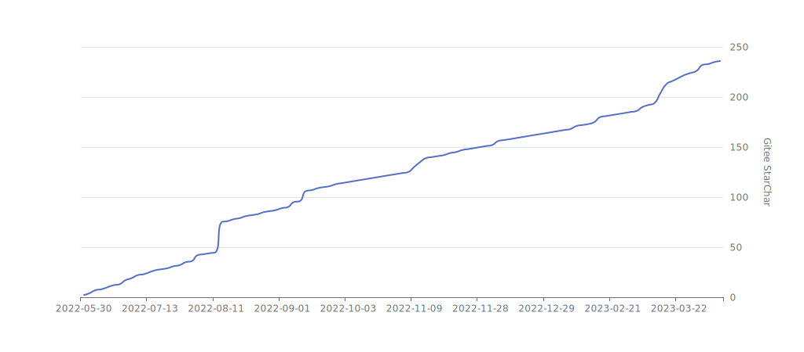

## 简介

- stream-query允许完全摆脱`Mapper`的`mybatis-plus`体验！，可以使用类似“工具类”这样的静态函数进行数据库操作

## 安装

[install](/docs/install.md ':include')

## 快速开始

[get-started](/docs/get-started.md ':include')

## 相关信息

## 项目参与者

剩余[点击查看](https://gitee.com/dromara/stream-query/contributors)

## 项目动态

## star 趋势

## Dromara 组织成员项目

?> 排名不分先后

[MaxKey](https://maxkey.top 'MaxKey: 业界领先的身份管理和认证产品')

[image-combiner](http://dromara.gitee.io/image-combiner 'image-combiner: 专门用于图片合成的工具')

[Cubic](https://cubic.jiagoujishu.com/ 'Cubic: 一站式问题分析解决平台')
[Easy-Trans](http://easy-trans.fhs-opensource.top/ 'Easy-Trans: 一个注解搞定数据翻译,减少30%SQL代码量')

## 友链

[AIoTDB物联网时序数据库](https://786744873.github.io/aiotdb/#/docs/02-core 'AIoTDB物联网时序数据库')

## 特别鸣谢

| 赞助人        | 金额        | 他的留言      | 赞助时间       |
|------------|-----------|-----------|------------|
| 简          | **`￥10`** | 感谢您的开源项目! | 2023-04-07 |
| 某不知道名三线程序员 | **`￥10`** | 感谢您的开源项目! | 2022-10-20 |
| 某不知道名三线程序员 | **`￥20`** | 感谢您的开源项目! | 2022-10-20 |
| 某不知道名三线程序员 | **`￥50`** | 感谢您的开源项目! | 2022-10-20 |
| 阿超         | **`￥10`** | 感谢您的开源项目! | 2022-10-20 |
| 阿超         | **`￥10`** | 感谢您的开源项目! | 2022-10-20 |

## 目录

[目录](_sidebar.md ':include')

